# Amazon EKS cluster concepts: control plane, nodes, networking, security, identity, and add-ons

> Last verified: **July 14, 2026**  
> Scope: Standard Amazon EKS clusters with EC2 worker nodes. EKS Auto Mode, Fargate, Hybrid Nodes, and Karpenter differ in important ways and are called out only where useful.

## Contents

1. [The whole cluster at a glance](#1-the-whole-cluster-at-a-glance)
2. [EKS control plane (formerly called master nodes)](#2-eks-control-plane-formerly-called-master-nodes)
3. [Worker nodes and node groups](#3-worker-nodes-and-node-groups)
4. [Region, VPC, Availability Zones, and subnets](#4-region-vpc-availability-zones-and-subnets)
5. [Cluster and worker-node security groups](#5-cluster-and-worker-node-security-groups)
6. [Node IAM role and EC2 instance profile](#6-node-iam-role-and-ec2-instance-profile)
7. [Cluster version and upgrade layers](#7-cluster-version-and-upgrade-layers)
8. [EKS logging](#8-eks-logging)
9. [Public and private Kubernetes API server access](#9-public-and-private-kubernetes-api-server-access)
10. [EKS API authentication mode](#10-eks-api-authentication-mode)
11. [Worker-node configuration in detail](#11-worker-node-configuration-in-detail)
12. [Worker-node Auto Scaling Groups](#12-worker-node-auto-scaling-groups)
13. [Load balancers and EKS](#13-load-balancers-and-eks)
14. [`aws-node`, CoreDNS, and `kube-proxy`](#14-aws-node-coredns-and-kube-proxy)
15. [Bottlerocket admin and control containers](#15-bottlerocket-admin-and-control-containers)
16. [IRSA: IAM roles for Kubernetes service accounts](#16-irsa-iam-roles-for-kubernetes-service-accounts)
17. [How all the identity systems differ](#17-how-all-the-identity-systems-differ)
18. [Operational checklist](#18-operational-checklist)
19. [Useful inspection commands](#19-useful-inspection-commands)
20. [References](#20-references)

---

## 1. The whole cluster at a glance

An EKS cluster is split across **two ownership and network boundaries**:

- AWS operates the Kubernetes control plane in an **AWS-managed VPC** that is not visible in your account.
- You operate the data plane—EC2 nodes, Pods, node ENIs, EBS volumes, and normally application load balancers—in **your VPC**.
- EKS creates cross-account elastic network interfaces, often called **EKS ENIs** or **X-ENIs**, in the cluster subnets you select. They enable control-plane communication with resources in your VPC.

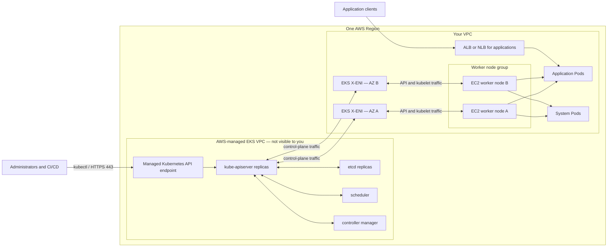

### Ownership summary

| Resource | Where it runs | Who operates it |
| --- | --- | --- |
| Kubernetes API server, etcd, scheduler, controller manager | AWS-managed VPC | AWS |
| EKS X-ENIs | Your selected cluster subnets | EKS manages them in your account/VPC |
| EC2 worker nodes and node ENIs | Your node subnets | You; EKS manages some lifecycle tasks for managed node groups |
| Pods | On your nodes | You and Kubernetes controllers |
| Application ALB/NLB | Your VPC | AWS Load Balancer Controller/EKS Auto Mode creates it; you pay for it |
| Control-plane endpoint load balancing | AWS-managed control-plane infrastructure | AWS; it is not your application load balancer |

---

## 2. EKS control plane (formerly called master nodes)

“Master node” is an older Kubernetes term. **Control plane** is the current term.

The EKS control plane contains:

- **`kube-apiserver`** — the front door for Kubernetes operations. `kubectl`, controllers, kubelets, and operators communicate through it.
- **`etcd`** — the strongly consistent database holding Kubernetes cluster state.
- **`kube-scheduler`** — chooses an eligible node for each unscheduled Pod.
- **`kube-controller-manager`** — runs reconciliation loops that move actual state toward desired state.
- **EKS-specific authentication and management components**.

EKS gives every cluster its own control plane. AWS places at least two API server instances and three `etcd` instances across three Availability Zones, monitors them, scales them, patches them, and replaces unhealthy instances. You do **not**:

- see the control-plane EC2 instances in your account;
- SSH to them;
- place them directly into your subnets;
- manage their Auto Scaling Groups; or
- install software on them.

The selected cluster subnets are still important: EKS creates X-ENIs in those subnets to connect its managed control plane to your VPC.

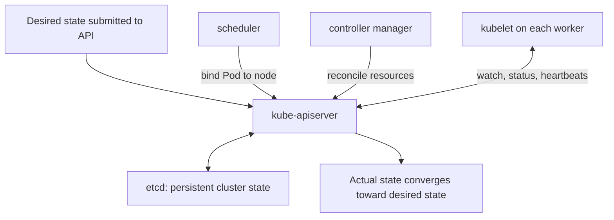

### Important distinction: EKS API versus Kubernetes API

- The **Amazon EKS API** creates and configures AWS-side resources such as clusters, managed node groups, add-ons, access entries, logging, and endpoint settings.
- The **Kubernetes API** creates and configures Kubernetes objects such as Pods, Deployments, Services, ConfigMaps, and RBAC bindings.

Creating an EKS cluster through the AWS API does not mean every Kubernetes operation is performed through the EKS API.

---

## 3. Worker nodes and node groups

A **worker node** is a machine registered as a Kubernetes `Node`. In the common EC2 data plane, it is an EC2 instance running:

- an operating system such as Amazon Linux 2023 or Bottlerocket;
- a container runtime, normally `containerd`;
- **`kubelet`**, the node agent;
- networking components such as the VPC CNI;
- `kube-proxy` in standard non-Auto-Mode clusters; and
- application and system Pods scheduled to that node.

A **node group** is a collection of similarly configured worker nodes. It provides a lifecycle and configuration boundary—not a Kubernetes scheduling boundary by itself. Use labels, taints, affinity, topology spread constraints, and resource requests to control scheduling.

### Common compute choices

| Choice | What manages EC2 lifecycle | Main use |
| --- | --- | --- |
| EKS managed node group | EKS manages provisioning, updates, drain workflow, and ASG integration | Default EC2 choice when you want AWS-managed lifecycle |
| Self-managed node group | You manage the launch template/configuration, ASG, bootstrap, updates, and drain behavior | Maximum control or legacy designs |
| Karpenter | Karpenter creates right-sized nodes in response to pending Pods | Dynamic, workload-driven provisioning |
| EKS Auto Mode | EKS manages more of compute, networking, load balancing, and storage | Lowest infrastructure-management burden |
| Fargate | AWS runs each Pod on serverless compute | No EC2 node management |

This guide focuses on the first two.

### Node-group relationships

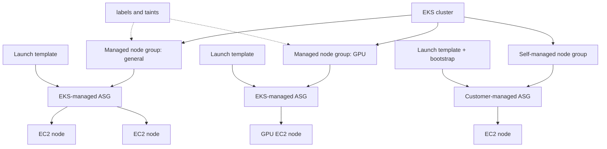

### Why use several node groups?

Typical boundaries include:

- On-Demand versus Spot capacity;
- CPU versus GPU instances;
- x86_64 versus Arm;
- general applications versus security-sensitive workloads;
- different operating systems or AMIs;
- different EBS root-volume sizes;
- different taints or labels; and
- single-AZ node groups for workloads tied to zonal EBS volumes.

---

## 4. Region, VPC, Availability Zones, and subnets

### Region

An EKS cluster is created in one AWS Region. Its control plane, VPC, cluster subnets, normal EC2 nodes, and regional load balancers are region-scoped. Multi-region resilience requires separate clusters and a higher-level traffic/data strategy.

### VPC

The cluster is associated with one customer VPC. Nodes, Pod addresses assigned by the VPC CNI, security groups, and application load balancers normally live in that VPC. The managed control plane itself lives in a separate AWS-managed VPC.

### Availability Zones

An Availability Zone is an isolated location inside a Region. EKS spreads the managed control plane across AZs. You should normally spread stateless worker capacity across multiple AZs as well.

### Cluster subnets versus node subnets

These terms are often confused:

- **Cluster subnets** are supplied when the EKS cluster is created. EKS can create X-ENIs in them. Select at least two supported subnets in different AZs and preserve spare IP addresses for EKS operations.
- **Node subnets** are supplied to a node group or provisioning system. The EC2 nodes are launched there.
- The two sets **may overlap**, but they do not have to. A common design uses small dedicated cluster subnets for X-ENIs and larger private node subnets for nodes and Pods.
- All selected cluster subnets belong to the cluster VPC. Node-group subnets also need the required network path to the cluster endpoint and AWS services.

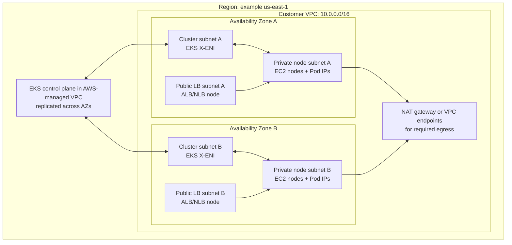

### Public and private subnet meaning

The label is determined by routing, not by EKS:

- A **public subnet** normally has a route to an internet gateway, and an instance needs a public IP to use that route.
- A **private subnet** has no direct route to an internet gateway. Outbound access may go through a NAT gateway, or private access to AWS services may use VPC endpoints.

Nodes in private subnets are a common production design. They still need paths to the Kubernetes API endpoint, ECR, S3, STS when IRSA is used, and any other required AWS or external services. A private-only cluster usually uses VPC endpoints and/or controlled egress.

### Pod placement and IP addresses

With the standard Amazon VPC CNI, a Pod usually receives a VPC-routable address from the node subnet. Therefore:

- subnet IP capacity limits both node and Pod growth;
- the EC2 instance type's ENI/IP limits affect maximum Pod density;
- prefix delegation can increase address efficiency and Pod density; and
- custom networking can place Pod addresses in alternate subnets.

---

## 5. Cluster and worker-node security groups

Security groups are stateful virtual firewalls attached to ENIs.

### EKS cluster security group

When EKS creates a cluster, it creates a default **cluster security group** named like `eks-cluster-sg-<cluster>-<id>`. EKS associates it with:

- the EKS-created X-ENIs in the cluster subnets; and
- by default, the ENIs of nodes in EKS managed node groups.

Its default rules allow all traffic from itself and broad outbound access. You can restrict outbound rules, but required control-plane, kubelet, DNS, registry, and service traffic must remain possible. EKS recreates some self-referencing rules during cluster updates if they are removed.

### Worker security group

“Worker security group” is a design term, not a special EKS resource type. It usually means a security group attached to worker-node ENIs. Depending on how the cluster was built:

- managed nodes may use the cluster security group directly;
- nodes may have both the cluster security group and additional application/administration security groups; or
- a custom launch template may attach custom node security groups instead.

If a custom launch template specifies security groups, EKS does **not** automatically add the cluster security group to that managed node group. The custom groups must allow all required node-to-control-plane and control-plane-to-node traffic, or the nodes will fail to join or operate correctly.

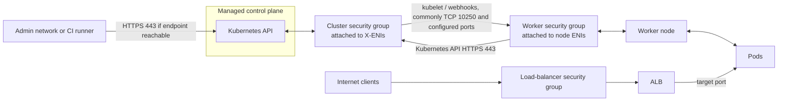

### Think in flows, not only ports

At minimum, verify these communication paths:

| Source | Destination | Purpose |
| --- | --- | --- |
| Nodes | Kubernetes API endpoint, TCP 443 | Registration, watches, status, leases, API operations |
| Control plane | Node kubelet, commonly TCP 10250 | Logs, exec/attach/port-forward and node operations |
| Control plane | Admission webhooks or aggregated APIs | Port depends on the webhook/service design |
| Nodes and Pods | DNS, registries, AWS APIs, dependencies | Runtime and bootstrap needs |
| Nodes/Pods | Other nodes/Pods | Application traffic and Kubernetes networking |
| Load balancer | NodePort or Pod target port | Inbound application traffic |

The API server's **public-access CIDR allowlist** and its **security groups** solve different problems. Endpoint settings determine whether a path is public/private and which public source CIDRs are accepted; security groups filter traffic reaching ENIs in your VPC.

---

## 6. Node IAM role and EC2 instance profile

The phrases “node IAM role,” “instance role,” and “instance profile role” are often used interchangeably, but AWS models two objects:

1. An **IAM role** has a trust policy and permission policies.
2. An **EC2 instance profile** is the container that makes one IAM role available to an EC2 instance through the Instance Metadata Service (IMDS).

For an EKS node:

- The role trusts the EC2 service principal, `ec2.amazonaws.com`, to call `sts:AssumeRole`.
- The instance profile exposes temporary credentials for that role to software on the node.
- `kubelet` and node-level agents use permissions such as describing EC2 resources and pulling required images from ECR.
- The node identity is authorized to join the Kubernetes cluster through an EKS access entry or, in older configurations, the `aws-auth` ConfigMap.

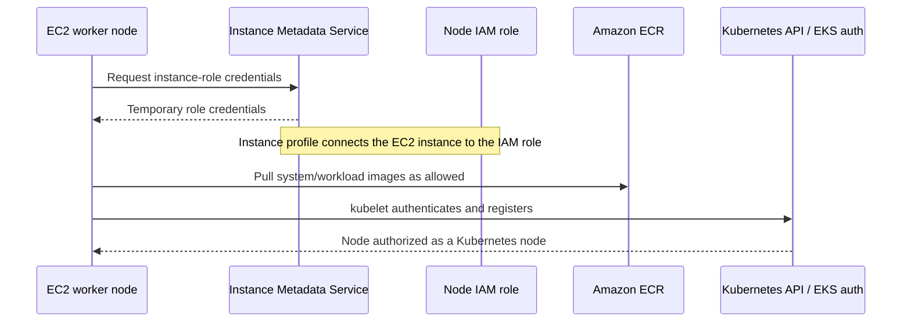

### Typical permission split

AWS currently documents these baseline managed policies for standard EC2 node roles:

- `AmazonEKSWorkerNodePolicy`
- `AmazonEC2ContainerRegistryPullOnly`

The VPC CNI also needs EC2 networking permissions. Prefer assigning those permissions to the `aws-node` service account through IRSA or EKS Pod Identity instead of broadening every node's role.

### Managed node-group detail

For an EKS managed node group, specify the **node IAM role in the node-group configuration**. Do not put an IAM instance profile in the custom launch template; EKS handles the instance-profile integration. Self-managed nodes require you to create and attach the instance profile yourself.

### Security boundary

Every Pod on a node should not automatically inherit the node's broad permissions. Use IRSA or EKS Pod Identity for workload permissions, minimize the node role, and restrict Pod access to IMDS where the design permits it.

---

## 7. Cluster version and upgrade layers

The EKS **cluster version** is the Kubernetes minor version used by the managed control plane, for example `1.xx`. It is not a single version switch for every component.

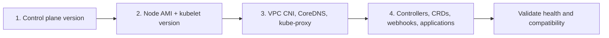

### Separate versioned layers

| Layer | Version owner | Upgrade behavior |
| --- | --- | --- |
| EKS control plane | EKS | You select a supported target; EKS performs the managed update |
| Managed node group | You initiate; EKS orchestrates replacement/drain | Not automatically upgraded merely because the control plane changed |
| Self-managed nodes | You | Replace or update AMI, bootstrap, kubelet, and runtime yourself |
| EKS add-ons | You normally choose compatible versions | Check the EKS add-on compatibility data for the target Kubernetes version |
| Workload APIs/controllers | You | Test removed/deprecated APIs, CRDs, webhooks, and controllers |

EKS currently describes a 26-month lifecycle for a Kubernetes minor version: 14 months of standard support followed by 12 months of extended support. Extended support has additional cost. After extended support ends, EKS eventually upgrades the control plane to the earliest supported version. Always verify the current schedule before planning an upgrade.

### Safe upgrade sequence

1. Check EKS upgrade insights, deprecated APIs, admission webhooks, and controller compatibility.
2. Upgrade one supported control-plane minor-version step.
3. Update managed/self-managed nodes so kubelet and the OS/AMI are compatible.
4. Update VPC CNI, CoreDNS, `kube-proxy`, CSI drivers, and other add-ons.
5. Validate DNS, networking, autoscaling, storage, logging, and workload health.
6. Repeat for the next minor version if needed.

Do not assume an EKS control-plane upgrade also upgrades nodes or add-ons. EKS Auto Mode has more automated behavior, but explicitly inspect it rather than applying the EC2 managed-node-group model blindly.

---

## 8. EKS logging

“EKS logging” covers several independent layers.

### Control-plane logging

EKS can send five control-plane log types to a cluster-specific CloudWatch Logs group:

| Log type | What it tells you |
| --- | --- |
| `api` | API server diagnostics and, when captured early enough, startup flags |
| `audit` | Who or what called the Kubernetes API and what action occurred |
| `authenticator` | IAM-to-Kubernetes authentication activity |
| `controllerManager` | Control-loop behavior |
| `scheduler` | Pod scheduling decisions and failures |

These log exports are **disabled by default** and enabled individually. CloudWatch ingestion, storage, and query costs apply. Delivery is best effort and can take a few minutes.

### Node and workload logging

Control-plane logging does not collect:

- container `stdout`/`stderr`;
- kubelet or container-runtime journals;
- operating-system logs;
- VPC flow logs; or
- application-specific log files.

Use an observability agent such as the Amazon CloudWatch Observability add-on, Fluent Bit, OpenTelemetry, or another logging stack to collect node and container logs. Configure retention, encryption, filtering, multiline parsing, and sensitive-data handling deliberately.

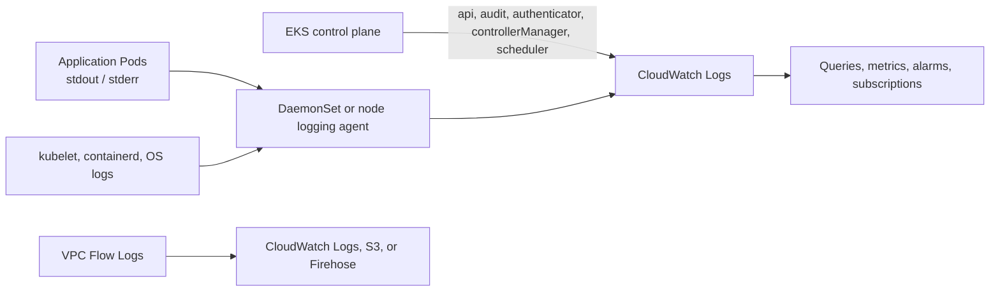

### Practical baseline

- Enable `audit`, `authenticator`, and `api` logs for security and troubleshooting; consider all five when the cost is acceptable.
- Set retention explicitly instead of retaining logs forever by accident.
- Alert on repeated authentication failures, forbidden operations, and suspicious changes to RBAC or privileged workloads.
- Keep workload and control-plane logs conceptually separate because their schemas, volume, and access rules differ.

---

## 9. Public and private Kubernetes API server access

Every EKS cluster has a managed Kubernetes API server endpoint. Endpoint access controls the **network path** to that endpoint; IAM authentication and Kubernetes authorization still decide what a caller may do.

### Supported endpoint patterns

| Public endpoint | Private endpoint | Behavior | Typical use |
| --- | --- | --- | --- |
| Enabled | Disabled | Endpoint reachable over its public address; node traffic leaves the VPC but stays on the AWS network | Simple setup; restrict public CIDRs |
| Enabled | Enabled | In-VPC clients use the private path; approved external clients can use public path | Common transitional or hybrid administration model |
| Disabled | Enabled | Only clients in the VPC or a connected network can reach the endpoint | Strong network isolation; requires VPN, Direct Connect, Transit Gateway, bastion, or in-VPC runner |
| Disabled | Disabled | Not supported | No usable API path |

For the private endpoint, EKS manages a private hosted zone associated with the VPC. VPC DNS support and hostnames must be enabled, and DHCP DNS configuration must support Amazon-provided DNS.

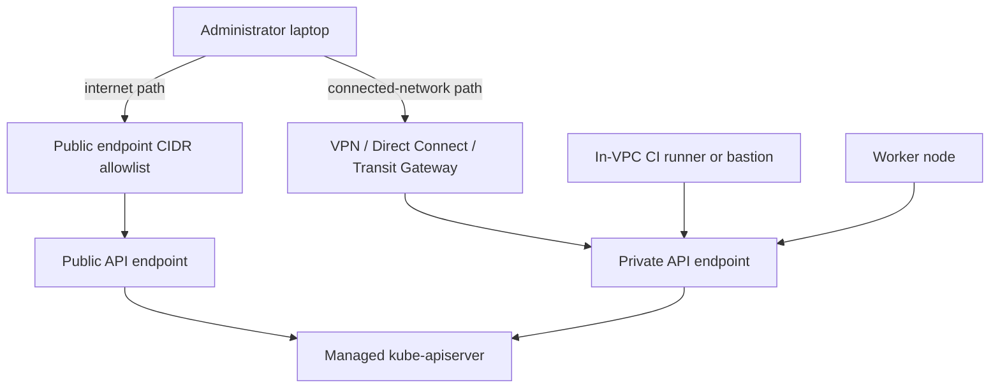

### A private endpoint does not grant access

A caller needs all three:

1. **Network reachability** to the endpoint.
2. **Authentication** as an IAM principal accepted by EKS.
3. **Authorization** through an EKS access policy and/or Kubernetes RBAC.

Failure at any layer can look like “`kubectl` cannot connect,” so troubleshoot the layers separately.

---

## 10. EKS API authentication mode

Because public/private endpoint access was listed separately, this guide interprets **“EKS API mode”** as the cluster's **authentication mode** for IAM principals.

| Authentication mode | IAM-to-Kubernetes mapping source | Meaning |
| --- | --- | --- |
| `CONFIG_MAP` | `aws-auth` ConfigMap | Legacy mode |
| `API_AND_CONFIG_MAP` | EKS access entries and `aws-auth` | Migration/coexistence mode |
| `API` | EKS access entries only | EKS API-managed access |

### Access-entry model

An EKS **access entry** associates an IAM principal with cluster access. You can then associate an EKS access policy or map the identity into Kubernetes groups used by RBAC.

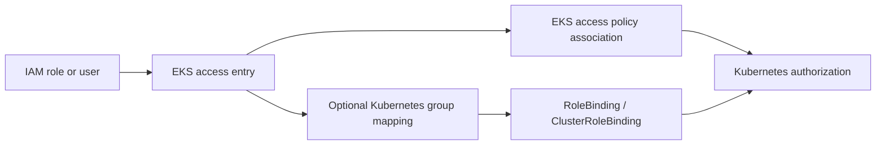

### Migration direction matters

The change is intentionally one-way:

```text
CONFIG_MAP  ->  API_AND_CONFIG_MAP  ->  API
```

After enabling the EKS access-entry API, you cannot change back to a mode that removes it. After switching to `API`, you cannot restore `aws-auth` as the cluster's authentication mapping source. Inventory existing mappings and create equivalent access entries before completing the migration.

### Do not confuse authentication with authorization

- IAM signing proves the caller's AWS identity.
- The authentication mode tells EKS where IAM-to-Kubernetes access mappings live.
- EKS access policies and Kubernetes RBAC determine allowed actions.
- Endpoint public/private configuration controls reachability, not permission.

---

## 11. Worker-node configuration in detail

### Node anatomy

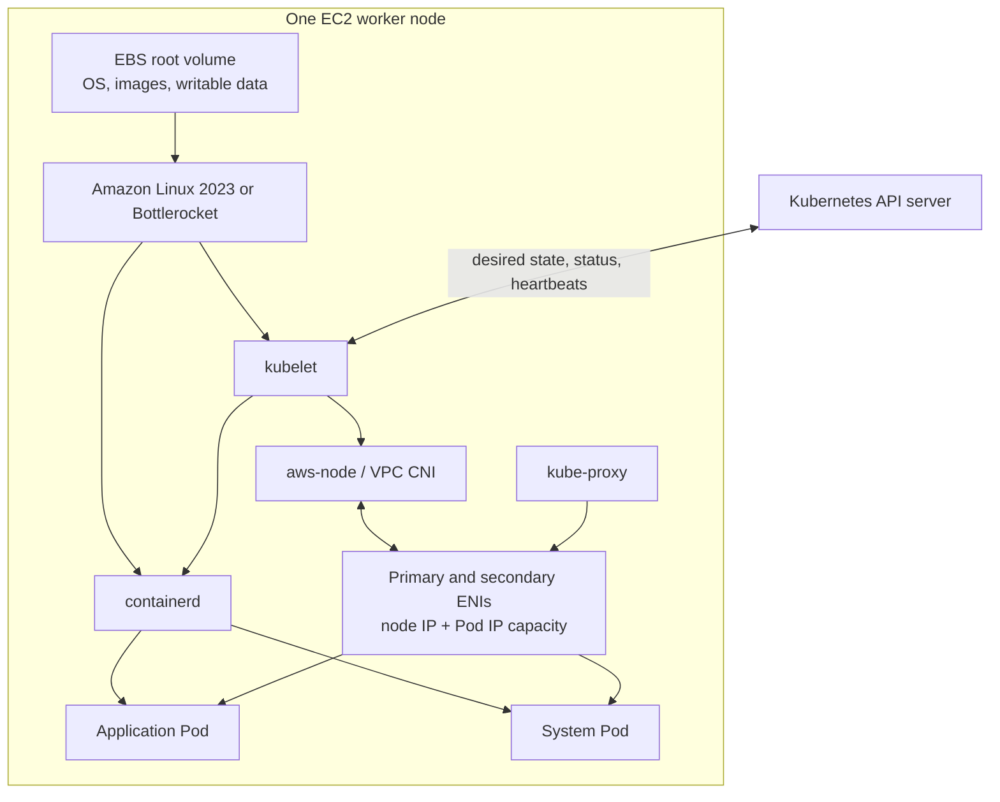

### Configuration fields

| Field | What it controls | Where it is normally set for a managed node group | Important notes |
| --- | --- | --- | --- |
| Subnets | AZs and IP ranges where node ENIs launch | Node-group network configuration | Do not specify subnet IDs in a custom launch template used by a managed node group |
| Instance type | vCPU, memory, ENI/IP limits, architecture, storage/network performance | Node-group config or launch template, not both | Multiple similar types improve Spot capacity flexibility |
| Capacity type | On-Demand or Spot | Node-group config | A managed node group contains one capacity type |
| AMI/OS | OS, kubelet, runtime, drivers | EKS AMI selection or custom AMI in launch template | Custom AMIs make you responsible for bootstrap and compatibility requirements |
| EC2 key pair | SSH login credential where the OS supports SSH | Launch template when one is used | Optional; a key pair alone does not open network access |
| Security groups | Node ENI firewall | Defaults from EKS or custom launch template | Custom SGs replace automatic cluster-SG attachment for that launch-template design |
| Root volume | EBS type, size, IOPS, throughput, encryption | Node-group disk size or launch template; with LT, configure the volume there | Treat node local/root data as replaceable unless explicitly designed otherwise |
| EC2 instance tags | AWS inventory, cost, automation | Launch-template `TagSpecification` | EKS node-group tags do not automatically propagate to EC2 instances |
| Kubernetes labels | Scheduling metadata | Managed node-group API or kubelet bootstrap | Use for node selection and affinity |
| Kubernetes taints | Repel Pods without matching tolerations | Managed node-group API or kubelet bootstrap | Useful for dedicated/GPU/system node groups |
| Kubelet configuration | Reservations, eviction, max Pods, labels, taints, feature behavior | AMI-specific user data or custom AMI; some labels/taints through node-group API | Test carefully; bad flags can keep a node from becoming Ready |

### Subnet

The node's primary ENI is created in one node-group subnet, so the node belongs to that subnet and AZ. With the standard VPC CNI, most Pod IPs are also allocated from that subnet unless custom networking is configured.

### Instance type

The instance type affects more than CPU and memory. It also controls:

- maximum ENIs and IPs/prefixes per ENI;
- achievable Pod density;
- architecture and accelerator availability;
- network and EBS bandwidth; and
- local instance-store availability.

### Key pair

An EC2 key pair is optional and OS-dependent. Amazon Linux may use it for SSH when the node security group and routing allow TCP 22. Bottlerocket does not run a normal SSH server; its supported management model uses SSM and host containers. Prefer SSM Session Manager over broadly exposing SSH.

### Tags, labels, and annotations are different

- **AWS tags** organize and control AWS resources. A tag on the EKS node-group resource does not automatically become an EC2 instance tag; add instance tags through the launch template.
- **Kubernetes labels** are queryable scheduling/selection metadata on Kubernetes objects.
- **Kubernetes annotations** store non-identifying metadata and controller configuration; schedulers do not select by annotation.

### Root volume

The root EBS volume stores the node OS, pulled container images, writable container layers, and often ephemeral Pod data. Size it for image churn and ephemeral-storage requests/limits. Enable EBS encryption. Kubernetes should treat nodes as replaceable; persistent application data normally belongs on persistent volumes or external services.

### `kubelet`

`kubelet` is the node agent. It:

- registers the node;
- watches the API server for Pods assigned to it;
- asks the container runtime to start/stop containers;
- invokes CNI behavior during Pod sandbox networking;
- mounts volumes through CSI integration;
- runs probes; and
- reports node and Pod status.

### Kubelet extra arguments

The exact mechanism depends on the AMI:

- **Amazon Linux 2023 EKS-optimized AMIs** use `nodeadm` and a `NodeConfig` document. `spec.kubelet.config` merges kubelet configuration and `spec.kubelet.flags` appends command-line flags.
- **Bottlerocket** uses its settings API/TOML user data.
- **Legacy Amazon Linux 2 examples** use `/etc/eks/bootstrap.sh --kubelet-extra-args ...`; do not copy those examples into AL2023 without adapting them.
- **Custom AMIs** require you to satisfy EKS bootstrap, certificate, endpoint, DNS, runtime, and kubelet requirements.

Example AL2023 `nodeadm` fragment:

```yaml
apiVersion: node.eks.aws/v1alpha1
kind: NodeConfig
spec:
  kubelet:
    config:
      shutdownGracePeriod: 30s
      shutdownGracePeriodCriticalPods: 10s
    flags:
      - --node-labels=workload-tier=general
```

Avoid using extra arguments for values the managed node-group API already owns, and avoid conflicting duplicate flags. Roll changes through a new launch-template version and replace nodes instead of hand-editing live instances.

---

## 12. Worker-node Auto Scaling Groups

Every EKS managed node group provisions nodes through an EC2 **Auto Scaling Group (ASG)** in your AWS account. A self-managed node group commonly uses an ASG that you create yourself.

An ASG understands EC2 capacity:

- **minimum size** — lower boundary;
- **desired size** — current target number of instances; and
- **maximum size** — upper boundary.

It does not understand unscheduled Pods by itself. A Kubernetes-aware component must translate workload demand into capacity changes.

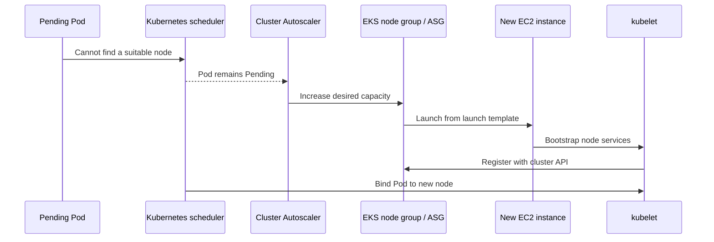

### Managed node-group behavior

- EKS owns the managed node group's lifecycle workflow and ASG integration.
- The ASG spans the node-group subnets you select.
- EKS can drain and replace nodes during managed updates.
- Managed node groups can enable node auto repair.
- EKS periodically synchronizes scaling configuration with the actual ASG values.
- Avoid manually changing the EKS-generated launch template or treating the underlying ASG as an independently managed resource.

### Cluster Autoscaler versus HPA

- **Horizontal Pod Autoscaler (HPA)** changes the number of Pod replicas.
- **Cluster Autoscaler** changes node-group/ASG desired capacity when Pods cannot be scheduled or nodes are underutilized.
- **ASG** launches or terminates EC2 instances to meet desired capacity.

These are separate loops and should be configured together.

### Scale-in safety

Draining interacts with PodDisruptionBudgets, termination grace periods, local storage, DaemonSets, and Spot interruption. Test scale-in. Some ASG-driven terminations such as AZ rebalance or reducing desired size have different disruption behavior from a managed node update.

---

## 13. Load balancers and EKS

There are two unrelated load-balancing ideas.

### 1. Control-plane endpoint load balancing

AWS uses managed load-balancing infrastructure in front of the replicated Kubernetes API servers. You do not create or configure this as an ALB/NLB for your applications.

### 2. Application load balancing

For workloads, the AWS Load Balancer Controller watches Kubernetes objects and creates Elastic Load Balancing resources in your VPC:

| Kubernetes object | Typical AWS resource | Layer/use |
| --- | --- | --- |
| `Ingress` | Application Load Balancer (ALB) | HTTP/HTTPS, host/path routing, Layer 7 |
| `Gateway` with supported controller version/configuration | Application Load Balancer (ALB) | Kubernetes Gateway API routing |
| `Service` with `type: LoadBalancer` | Network Load Balancer (NLB) | TCP/UDP/TLS, Layer 4 |

There is **not automatically one application load balancer per EKS cluster**. Controllers create load balancers in response to Kubernetes resources. Multiple Services can create multiple NLBs; Ingress grouping can share an ALB when deliberately configured.

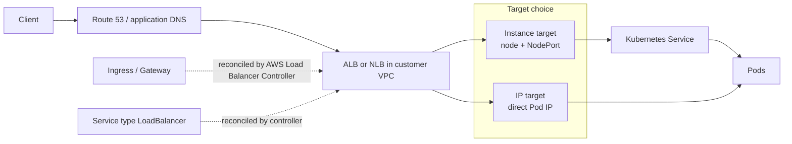

### Subnet placement

- Internet-facing load balancers use suitable public subnets.
- Internal load balancers use suitable private subnets.
- ALBs require subnets in at least two AZs.
- Subnet tags or explicit annotations/configuration help the controller discover the intended subnets.

### Target types

- **Instance target** sends traffic to a node's NodePort, then Kubernetes networking forwards it to a Pod.
- **IP target** registers Pod IPs directly and avoids the NodePort hop. It is required for some compute types and often gives more direct routing.

The controller normally needs AWS permissions. Give its Kubernetes service account a dedicated IRSA or EKS Pod Identity role instead of adding load-balancer permissions to every node.

---

## 14. `aws-node`, CoreDNS, and `kube-proxy`

If “AWS nodes” means **`aws-node`**, it is the DaemonSet used by the Amazon VPC CNI. If it means nodes running on AWS, those are the EC2 worker nodes described earlier.

### `aws-node` / Amazon VPC CNI

- Runs as a DaemonSet, normally one Pod per EC2 node.
- Contains the node-local IP address management functionality (`ipamd`).
- Manages ENIs, secondary IP addresses, and/or prefixes used for Pod networking.
- Works with a CNI binary on the node that kubelet invokes when creating or deleting Pod sandboxes.
- Requires EC2 networking permissions, ideally through a dedicated IRSA or Pod Identity role.

### CoreDNS

- Runs as a Deployment with multiple replicas, not one copy per node.
- Implements Kubernetes cluster DNS.
- Resolves Kubernetes Service names such as `my-service.my-namespace.svc.cluster.local`.
- Forwards non-cluster queries according to its Corefile configuration.
- Its Pods need available worker capacity unless they are scheduled to Fargate or managed differently.

### `kube-proxy`

- Runs as a DaemonSet, normally one Pod per EC2 node in a standard cluster.
- Watches Services and EndpointSlices.
- Programs node network rules so Service virtual IPs reach healthy Pod endpoints.
- Does not allocate Pod IPs and does not provide DNS.

EKS Auto Mode provides these networking capabilities differently and does not require you to install the standard networking add-ons in the same way.

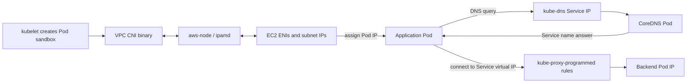

### Quick comparison

| Component | Kubernetes form | Main job | Usually per node? |
| --- | --- | --- | --- |
| `aws-node` | DaemonSet | VPC Pod networking and IP/ENI management | Yes, on EC2 nodes |
| CoreDNS | Deployment | Cluster DNS and service discovery | No; replicated centrally as Pods |
| `kube-proxy` | DaemonSet | Service-to-endpoint forwarding rules | Yes, on EC2 nodes |

---

## 15. Bottlerocket admin and control containers

The **admin container** and **control container** are Bottlerocket host containers. They are not normal parts of Amazon Linux worker nodes, and they are not Kubernetes Pods.

Bottlerocket is a minimal, container-focused OS. It uses a separate host-container runtime for management functions.

### Control container

- Provides a pathway to manage the node through AWS Systems Manager Session Manager.
- Provides access to the Bottlerocket API and `apiclient`.
- Can provide an entry point to the admin container.
- Is intended for routine management access without a conventional SSH server.

### Admin container

- Has elevated privileges and mounts the host root filesystem.
- Provides deeper troubleshooting access when normal orchestration is unavailable.
- Should be enabled only when needed and tightly controlled.
- AWS recommends it for development/troubleshooting rather than routine production access.

### They are outside Kubernetes orchestration

Kubernetes does not schedule or manage these host containers. Bottlerocket settings control their lifecycle. Bottlerocket uses one `containerd` instance for Kubernetes workloads and a separate one for host containers.

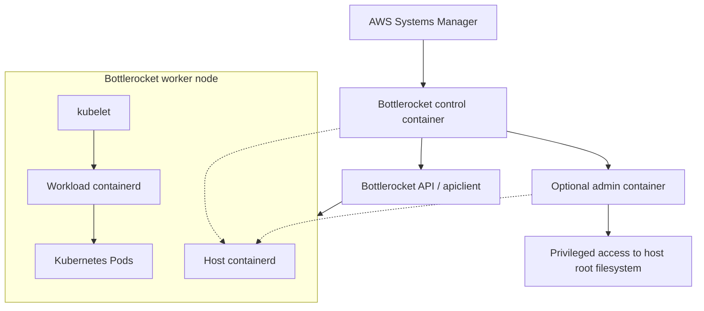

Because the admin container is highly privileged, access to it should be logged, time-bounded, and protected with least-privilege SSM/IAM controls.

---

## 16. IRSA: IAM roles for Kubernetes service accounts

**IRSA** means IAM Roles for Service Accounts. It gives a Kubernetes workload a dedicated IAM role instead of making it use the node IAM role.

### Building blocks

1. The EKS cluster exposes an OpenID Connect (OIDC) issuer.
2. An IAM OIDC provider is associated with that issuer in your AWS account.
3. An IAM role trusts that OIDC provider, restricted to an expected Kubernetes namespace and service account.
4. The Kubernetes service account is annotated with the IAM role ARN.
5. A Pod using that service account receives a projected, short-lived service-account token.
6. A compatible AWS SDK exchanges the token through STS `AssumeRoleWithWebIdentity` and receives temporary credentials.

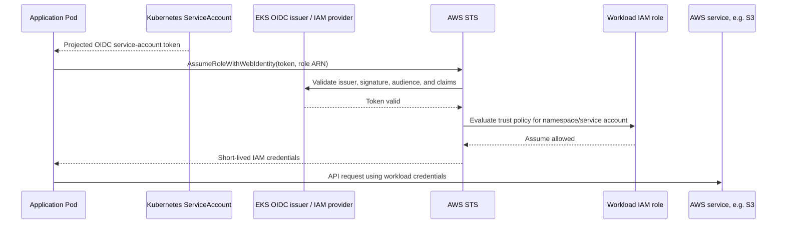

### Example Kubernetes service account

```yaml
apiVersion: v1
kind: ServiceAccount
metadata:
  name: reports-reader
  namespace: reports
  annotations:
    eks.amazonaws.com/role-arn: arn:aws:iam::111122223333:role/reports-reader
```

The IAM role trust policy should restrict the token claims, typically:

- audience (`aud`) to `sts.amazonaws.com`; and
- subject (`sub`) to `system:serviceaccount:reports:reports-reader`.

### Why IRSA is safer than the node role

- Different workloads get different least-privilege roles.
- Credentials are temporary.
- CloudTrail records the assumed workload role.
- A compromised Pod does not automatically receive every permission needed by node agents.

### Limitations and cautions

- IRSA is not a security boundary between containers in the same Pod.
- A Pod that can reach IMDS might fall back to node credentials depending on SDK/configuration; restrict IMDS access and use current SDKs.
- The role trust policy is as important as its permission policy. Wildcards across namespaces or service accounts broaden who may assume it.
- OIDC issuer reachability can complicate creating the IAM OIDC provider from a private, DNS-isolated environment.
- EKS Pod Identity is a newer EKS-specific alternative with a different credential path. IRSA remains relevant and portable across compatible Kubernetes environments.

---

## 17. How all the identity systems differ

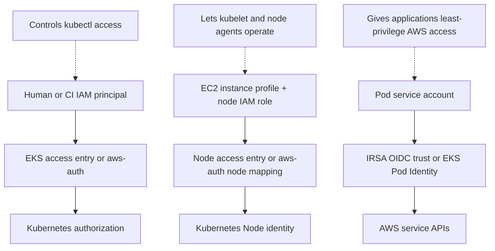

| Identity | Used by | Authenticates to | Main purpose |
| --- | --- | --- | --- |
| Cluster IAM role | EKS service | AWS APIs | Lets EKS manage resources needed for the cluster |
| Node IAM role through instance profile | EC2 node software | AWS APIs and cluster node authentication path | Node registration, ECR pulls, node-agent operations |
| Human/CI IAM role plus EKS access entry | Administrators and automation | Kubernetes API | Cluster administration and deployment |
| Kubernetes RBAC role | Kubernetes users/service accounts | Kubernetes API | Authorization inside Kubernetes |
| IRSA workload IAM role | Pods using one service account | AWS APIs through STS | Fine-grained application AWS permissions |

No one role should be reused for all of these jobs.

---

## 18. Operational checklist

### Architecture

- [ ] Cluster subnets exist in at least two supported AZs and retain spare IP capacity.
- [ ] Node subnets have enough addresses for nodes, Pod IPs, and growth.
- [ ] Nodes are distributed across AZs appropriate for the workloads.
- [ ] Private nodes have NAT or VPC endpoints for required services.

### Security

- [ ] Public API access is disabled or restricted to approved CIDRs.
- [ ] Private API access is enabled when nodes or administrators should use the VPC path.
- [ ] Security groups allow only the required control-plane, node, Pod, DNS, and load-balancer flows.
- [ ] Node role permissions are minimal; workload permissions use IRSA or EKS Pod Identity.
- [ ] SSH is avoided or restricted; SSM is preferred where practical.
- [ ] EBS volumes and logs use appropriate encryption.

### Reliability and upgrades

- [ ] Node groups have appropriate minimum, desired, and maximum sizes.
- [ ] Pod requests, PodDisruptionBudgets, topology spread, and autoscaler behavior are tested.
- [ ] Control plane, nodes, and add-ons are tracked as separate version layers.
- [ ] Deprecated APIs and webhook/controller compatibility are checked before upgrades.
- [ ] Spot workloads tolerate interruption and are diversified across suitable instance types.

### Observability

- [ ] Required control-plane logs are enabled with explicit retention.
- [ ] Node and container logs are shipped separately.
- [ ] Metrics and alerts cover node readiness, pending Pods, DNS, CNI IP exhaustion, API errors, and load-balancer target health.
- [ ] CloudTrail and audit logs can answer who changed access, RBAC, node groups, and cluster settings.

---

## 19. Useful inspection commands

Replace example values before running these commands.

### Describe the EKS cluster

```bash
aws eks describe-cluster \
  --name my-cluster \
  --region us-east-1 \
  --query 'cluster.{Version:version,Endpoint:endpoint,Vpc:resourcesVpcConfig.vpcId,Subnets:resourcesVpcConfig.subnetIds,ClusterSG:resourcesVpcConfig.clusterSecurityGroupId,Public:endpointPublicAccess,Private:endpointPrivateAccess,AuthMode:accessConfig.authenticationMode,Logs:logging.clusterLogging}'
```

### List and inspect managed node groups

```bash
aws eks list-nodegroups --cluster-name my-cluster --region us-east-1

aws eks describe-nodegroup \
  --cluster-name my-cluster \
  --nodegroup-name general \
  --region us-east-1
```

### See nodes, versions, labels, and placement

```bash
kubectl get nodes \
  -o custom-columns='NAME:.metadata.name,VERSION:.status.nodeInfo.kubeletVersion,OS:.status.nodeInfo.osImage,TYPE:.metadata.labels.node\.kubernetes\.io/instance-type,ZONE:.metadata.labels.topology\.kubernetes\.io/zone,NODEGROUP:.metadata.labels.eks\.amazonaws\.com/nodegroup'
```

### Inspect the three networking add-ons

```bash
kubectl -n kube-system get daemonset aws-node kube-proxy
kubectl -n kube-system get deployment coredns
kubectl -n kube-system get pods -o wide
```

### List installed EKS add-ons and compatible versions

```bash
aws eks list-addons --cluster-name my-cluster --region us-east-1

aws eks describe-addon-versions \
  --kubernetes-version 1.xx \
  --region us-east-1
```

### Inspect access entries

```bash
aws eks list-access-entries \
  --cluster-name my-cluster \
  --region us-east-1
```

### Check IRSA annotation on a service account

```bash
kubectl -n reports get serviceaccount reports-reader -o yaml
```

---

## 20. References

AWS and Kubernetes behavior changes over time. Verify version-specific details against current documentation before making production changes.

### EKS architecture, networking, and security

- [Amazon EKS architecture](https://docs.aws.amazon.com/eks/latest/userguide/eks-architecture.html)
- [VPC and subnet considerations](https://docs.aws.amazon.com/eks/latest/best-practices/subnets.html)
- [Cluster API server endpoint](https://docs.aws.amazon.com/eks/latest/userguide/cluster-endpoint.html)
- [Amazon EKS security group requirements](https://docs.aws.amazon.com/eks/latest/userguide/sec-group-reqs.html)
- [Amazon VPC CNI best practices](https://docs.aws.amazon.com/eks/latest/best-practices/vpc-cni.html)

### Nodes, node groups, and versions

- [Self-managed nodes](https://docs.aws.amazon.com/eks/latest/userguide/worker.html)
- [EKS managed node groups](https://docs.aws.amazon.com/eks/latest/userguide/managed-node-groups.html)
- [Customize managed nodes with launch templates](https://docs.aws.amazon.com/eks/latest/userguide/launch-templates.html)
- [Amazon EKS node IAM role](https://docs.aws.amazon.com/eks/latest/userguide/create-node-role.html)
- [Kubernetes version lifecycle on EKS](https://docs.aws.amazon.com/eks/latest/userguide/kubernetes-versions.html)
- [Amazon EKS AMI `nodeadm` documentation](https://awslabs.github.io/amazon-eks-ami/nodeadm/)

### Authentication and workload identity

- [Change authentication mode to use access entries](https://docs.aws.amazon.com/eks/latest/userguide/setting-up-access-entries.html)
- [Create EKS access entries](https://docs.aws.amazon.com/eks/latest/userguide/creating-access-entries.html)
- [Assign IAM roles to Kubernetes service accounts](https://docs.aws.amazon.com/eks/latest/userguide/associate-service-account-role.html)
- [IAM permissions for EKS workloads: IRSA and Pod Identity](https://docs.aws.amazon.com/eks/latest/userguide/service-accounts.html)

### Add-ons, logging, load balancing, and Bottlerocket

- [EKS networking add-ons](https://docs.aws.amazon.com/eks/latest/userguide/eks-networking-add-ons.html)
- [Amazon EKS add-ons](https://docs.aws.amazon.com/eks/latest/userguide/eks-add-ons.html)
- [EKS control-plane logging](https://docs.aws.amazon.com/eks/latest/userguide/control-plane-logs.html)
- [AWS Load Balancer Controller for EKS](https://docs.aws.amazon.com/eks/latest/userguide/aws-load-balancer-controller.html)
- [Application Load Balancers on EKS](https://docs.aws.amazon.com/eks/latest/userguide/alb-ingress.html)
- [Bottlerocket optimized AMIs](https://docs.aws.amazon.com/eks/latest/userguide/eks-optimized-ami-bottlerocket.html)
- [Bottlerocket host containers](https://bottlerocket.dev/en/os/1.60.x/concepts/host-containers/)
